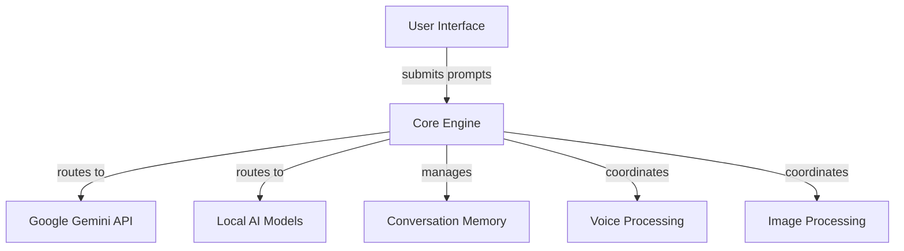

# AYNAGH0R

A unified intelligence architecture for dark‑fantasy / erotic storytelling.

## Quick start
```bash
# 1️⃣ Install dependencies
pip install -r requirements.txt

# 2️⃣ Set up environment configuration
cp .env.example .env
# Edit .env with your API keys and preferences

# 3️⃣ Run the application
streamlit run ui/app.py --server.port=8501
```

## Features
- **Dark Fantasy & Erotic Storytelling**: Specialized AI content generation
- **Multiple AI Providers**: Support for Google Gemini and Local AI models
- **Interactive Chat Interface**: Modern dark-themed Streamlit UI
- **Conversation Memory**: Persistent chat history with export functionality
- **Creative Tools**: Random prompts and story starters
- **Modular Architecture**: Extensible voice and image processing capabilities

## Architecture diagram

