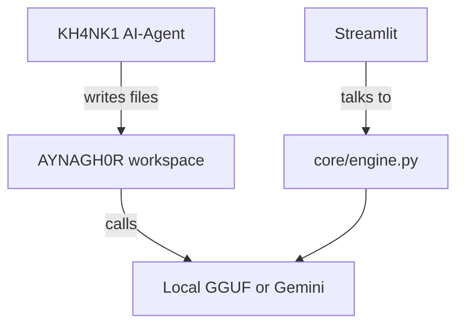

# AYNAGH0R

A unified intelligence architecture for dark‑fantasy / erotic storytelling.

## Quick start
```bash
# 1️⃣ Build the agent (already running via OpenHands)
# 2️⃣ Let the agent generate the app skeleton (run the script below)
python /app/agent/scripts/generate_aynaghor.py

# 3️⃣ Build & run the UI service (see docker‑compose.aynaghor.yml)
```

## Architecture diagram

